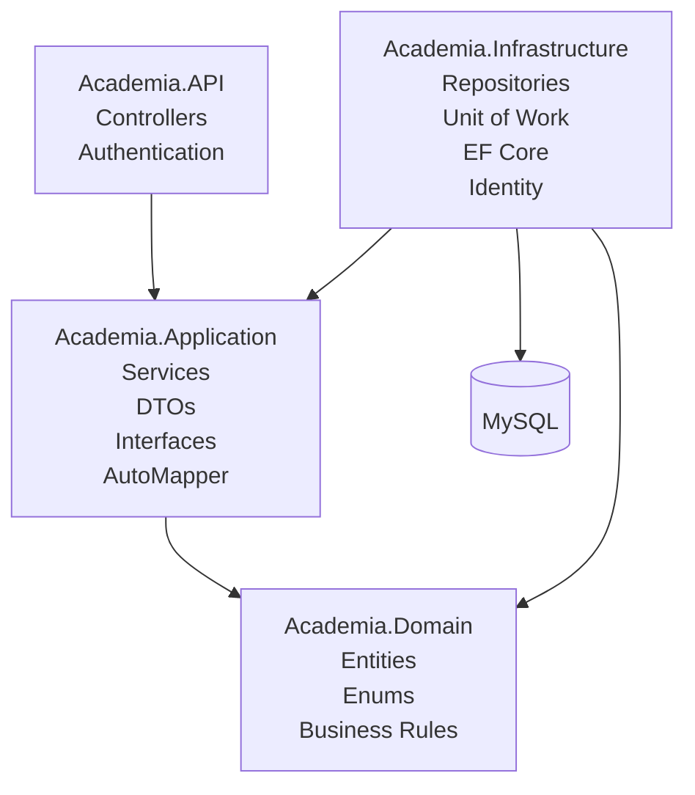

# Sistema de Gerenciamento de Academia

API REST para gerenciamento de uma academia, desenvolvida com C# e ASP.NET Core.

O projeto foi desenvolvido com foco em práticas de desenvolvimento backend, arquitetura baseada em Clean Architecture, desenvolvimento de APIs REST, persistência de dados, autenticação e autorização, paginação e testes automatizados.

## Demonstração

  Disponível no deploy do Render

  [Acesse o Swagger](https://programaacademia.onrender.com/swagger/index.html)

A API pode ser explorada e testada diretamente através do Swagger.
## Tecnologias

- C#
- .NET 10
- ASP.NET Core Web API
- Entity Framework Core
- MySQL
- ASP.NET Core Identity
- JWT Authentication
- AutoMapper
- Swagger / OpenAPI
- Repository Pattern
- Unit of Work
- DTOs
- Paginação
- xUnit
- Moq
- Docker

## Ferramentas

- Visual Studio
- Visual Studio Code
- Git
- GitHub
- MySQL
- Swagger


## Arquitetura

O backend utiliza uma arquitetura baseada na separação de responsabilidades entre as camadas Domain, Application, Infrastructure e API.



A separação das responsabilidades permite reduzir o acoplamento entre as camadas e facilita a manutenção e evolução da aplicação.

## Funcionalidades

### Alunos

- Cadastro de alunos
- Consulta de alunos
- Consulta de aluno por ID
- Atualização de dados
- Remoção de alunos
- Validação de CPF
- Paginação
- Consulta de matrículas relacionadas

### Matrículas

- Cadastro de matrículas
- Consulta de matrículas
- Associação entre aluno e plano
- Controle do status da matrícula

### Planos

- Cadastro de planos
- Consulta de planos
- Atualização de planos
- Remoção de planos

### Autenticação e autorização

- Cadastro de usuários
- Login
- JWT Authentication
- Access Token
- Refresh Token
- ASP.NET Core Identity
- Controle de acesso baseado em Roles

## API

A aplicação disponibiliza uma API REST para gerenciamento dos recursos da academia.

Exemplos de operações:

```http
GET    /api/student
GET    /api/student/{id}
POST   /api/student
PUT    /api/student/{id}
DELETE /api/student/{id}
```

As requisições para endpoints protegidos utilizam autenticação baseada em Bearer Token:

```http
Authorization: Bearer {access_token}
```

A API possui documentação através do Swagger / OpenAPI, permitindo visualizar e testar os endpoints disponíveis.

## Paginação

As consultas que podem retornar grandes quantidades de registros utilizam paginação.

Exemplo:

```http
GET /api/student?page=1&pageSize=10
```

Exemplo de resposta:

```json
{
  "currentPage": 1,
  "pageSize": 10,
  "totalCount": 100,
  "totalPages": 10,
  "items": []
}
```

A paginação reduz a quantidade de dados processados e transferidos em cada requisição.

## Banco de Dados

O projeto utiliza MySQL como banco de dados relacional e Entity Framework Core como ORM.

Principais relacionamentos:

```text
Student
   │
   └── Enrollment
          │
          └── Plan
```

Os relacionamentos entre as entidades são configurados utilizando Entity Framework Core.

As alterações na estrutura do banco são controladas através de EF Core Migrations.

## Controle de acesso

O acesso aos endpoints protegidos é controlado através de Roles.

### Perfis disponíveis
### Admin

- Possui acesso aos endpoints protegidos da API.
- Pode gerenciar alunos, planos e matrículas.
- Pode cadastrar novos usuários com a role Employee.

### Employee

- Possui acesso aos endpoints protegidos da API.
- Pode gerenciar alunos, planos e matrículas.
- Não pode cadastrar novos usuários Employee.
### Usuário sem autenticação

- Não possui acesso aos endpoints protegidos.

## Configuração do Ambiente

### Pré-requisitos

- .NET 10 SDK
- MySQL
- Git

### Clonar o repositório

```bash
git clone https://github.com/RafaelSantos28d/ProgramaAcademia.git
cd ProgramaAcademia
```

### Configuração do banco

Configure a connection string utilizando User Secrets ou variáveis de ambiente.

Exemplo:

```text
Server=localhost;
Database=Academia;
User=root;
Password=SUA_SENHA;
```

Não utilize credenciais reais diretamente no código ou em arquivos versionados no GitHub.

### User Secrets

Inicialize o User Secrets no projeto da API:

```bash
dotnet user-secrets init
```

Configure a connection string:

```bash
dotnet user-secrets set "ConnectionStrings:DefaultConnection" "SUA_CONNECTION_STRING"
```

Configure o JWT Secret:

```bash
dotnet user-secrets set "Jwt:Secret" "SEU_SECRET"
```

Informações sensíveis não devem ser adicionadas ao repositório.

## Migrations

Para aplicar as migrations existentes:

```bash
dotnet ef database update
```

Caso seja necessário especificar os projetos:

```bash
dotnet ef database update \
    --project Academia.Infrastructure \
    --startup-project Academia.API
```

Para criar uma nova migration:

```bash
dotnet ef migrations add NomeDaMigration
```

## Executando a API

Execute:

```bash
dotnet run
```

Após iniciar a aplicação, a documentação da API estará disponível através do Swagger:

```text
https://localhost:{porta}/swagger
```

## Testes

O projeto possui testes automatizados para componentes da aplicação, incluindo Controllers e Services.

Os testes utilizam xUnit e Moq para validação dos comportamentos da aplicação.

São testados cenários como:

- Regras de negócio
- Criação de recursos
- Atualização de recursos
- Remoção de recursos
- Consultas
- Respostas HTTP
- Interações com dependências utilizando mocks

## Principais conceitos e práticas aplicados

- Desenvolvimento de APIs REST com ASP.NET Core
- C# e programação orientada a objetos
- Clean Architecture
- Entity Framework Core
- MySQL
- Repository Pattern
- Unit of Work
- DTOs
- AutoMapper
- Autenticação e autorização
- ASP.NET Core Identity
- JWT Authentication
- Paginação
- Testes automatizados
- Git e GitHub
- Gerenciamento de configurações e secrets
- Docker
